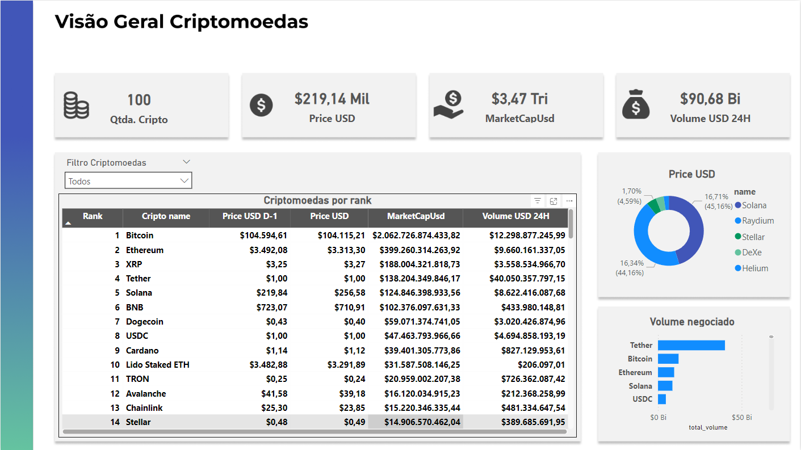

# Teste de engenharia de dados, Cadastra

## Descricao sobre o teste:
Este desafio destaca a capacidade de criar uma solução completa, desde a coleta de dados por meio de uma API até o armazenamento eficiente desses dados em um banco de dados relacional.

## Tecnologias Utilizadas
- Python: Coleta e transformação de dados.
- BigQuery: Armazenamento de dados.
- Power BI: Visualização e análise de dados.

## Todos o processo necessário para criação: 

- Obter os dados da API de criptomoedas.
- Processar e transformar os dados.
- Armazenar os dados em um banco de dados.
- Criar visualizações no Power BI.

## Coleta de Dados

### Script principal para realizar as requisições e tratamentos necessários aos dados.
- [Script Principal](scritps)

### Aplicação da Metodologia Medalhão
Estruturei os dados em camadas:
- Bronze: Dados brutos extraídos da API.
- Silver: Dados tratados e normalizados.
- Gold: Dados prontos para visualização e análise.

### Transformação e tratamento realizados
Ferramenta usada: Python
- Criei variáveis de ambiente para guardar a chave de API e service account do GCP, como pedido no teste. Utilizei a biblioteca dotenv
- Foi realizado o acesso a API e extração dos dados através da biblioteca requests.
- Utilizei pandas e pandas_gbq para manipulação e transformação dos dados.

### Armazenamento dos Dados
Banco de Dados: BigQuery.
Configurei a conexão da API com o BigQuery para armazenar os dados.
Transformei os dados em tabelas otimizadas para consultas.

## Bronze, dados brutos:

## Silver, dados limpos e com o tipo correto:

## Gold, somente as colunas necessárias para a criação do dashboard:

## Visualizações no Power BI
Importei os dados do BigQuery para o Power BI, e realizei a construção da visão com os principais KPIs pedidos no teste: 

## Prévia do dashboard:

